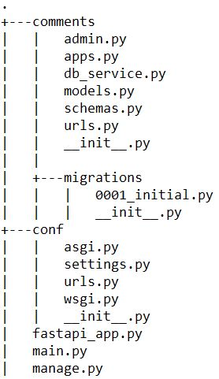

## Comments API 

:white_check_mark: FastAPI with Django ORM   

### Directory hierarchy
        

* **models**: Django models
* **urls**: FastAPI routers
* **schemas**: Pydantic models
* **db_service**: database context
____
### Required environment variables:

* **DB_NAME** - database name
* **DB_USER** - database user
* **DB_PASSWORD** - database password
_____
### Migration before the run

python manage.py migrate
_____

### Run
uvicorn fastapi_app:app _# FastApi_

http://127.0.0.1:8000/docs#/ _#Swagger UI_

uvicorn conf.asgi:application --port 9090  _# Django_

http://127.0.0.1:9090/admin/ _# Admin panel_
_____

Dependencies are listed in **requirements.txt**

